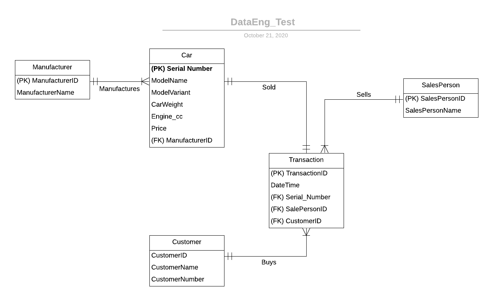

# DSAID Data Engineering Technical Test

## Section 2: Databases
You are appointed by a car dealership to create their database infrastructure. There is only one store. In each business day, cars are being sold by a team of salespersons. Each transaction would contain information on the date and time of transaction, customer transacted with, and the car that was sold. 

The following are known:
- Both used and new cars are sold.
- Each car can only be sold by one salesperson.
- There are multiple manufacturers’ cars sold.
- Each car has the following characteristics:
- Manufacturer
- Model name
- Model variant
- Serial number
- Weight
- Engine cubic capacity
- Price

Each sale transaction contains the following information:
- Customer Name
- Customer Phone
- Salesperson
- Characteristics of car sold

Set up a PostgreSQL database using the base `docker` image [here](https://hub.docker.com/_/postgres) given the above. We expect at least a `Dockerfile` which will stand up your database with the DDL statements to create the necessary tables. Produce entity-relationship diagrams as necessary to illustrate your design.

## Entity-Relationship Diagram
 

 ## Creating docker image and running container

1. First cd to this folder
2. run `docker build -t psql_image:latest .`
3. run `docker run -p 5432:5432 -d --name psql_container psql_image:latest`
4. run `docker exec -it psql_container psql -U postgres`
5. connect to db by running `\c car-dealership`