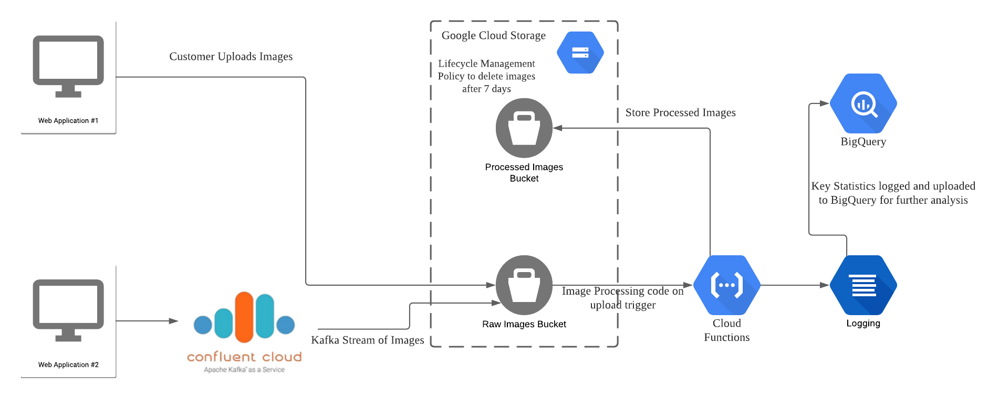

# DSAID Data Engineering Technical Test

## Section 3: System Design
You are designing data infrastructure on the cloud for a company whose main business is in processing images. 

The company has a web application which collects images uploaded by customers. The company also has a separate web application which provides a stream of images using a Kafka stream. The company’s software engineers have already some code written to process the images. The company  would like to save processed images for a minimum of 7 days for archival purposes. Ideally, the company would also want to be able to have some Business Intelligence (BI) on key statistics including number and type of images processed, and by which customers.

Produce a system architecture diagram (e.g. Visio, Powerpoint) using any of the commercial cloud providers' ecosystem to explain your design. Please also indicate clearly if you have made any assumptions at any point.

## System Design
System Architecture Diagram is designed using LucidChart

### Assumptions:
* Images uploaded by customers and the images from the Kafka stream can be processed in an identical way, and the same statistics can be calculated from images coming from these 2 sources.
* The Kafka stream is also assumed to be set up using Confluent Cloud on the Google Cloud Platform (GCP).

The company has 2 separate web applications that provides data. The customer facing webapp that collects images uploaded by customers will upload the images directly into a [google cloud storage](https://cloud.google.com/storage/) bucket for raw images, while the other webapp that provides a stream of images using a Kafka stream will be ingested and directed into the same google cloud storage bucket using [Confluent Cloud](https://www.confluent.io/confluent-cloud).

A google cloud function is [triggered on each image upload to cloud storage bucket](https://firebase.google.com/docs/functions/gcp-storage-events), where the image processing code is run through the image to obtain the processed image. These images are then fed into another google cloud storage bucket, where a [lifecycle management policy](https://cloud.google.com/storage/docs/lifecycle) can be set to delete the image after 7 days of upload.

The cloud function should also calculate key statistics on the images, such as the number and type of images processed, and log these statistics to the [cloud logging platform](https://cloud.google.com/logging/). 

These logs can then be periodically exported to [Google BigQuery database](https://cloud.google.com/bigquery/), where further analysis and Business Intelligence(BI) can be done. This periodic export of data can be done using a [cloud scheduler](https://cloud.google.com/scheduler/).